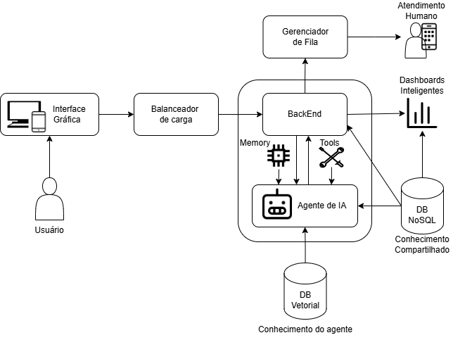

# Chatbot de Atendimento ao Cliente para Vendas de Marketplace de Eletrônicos

## 1. Utilidade do Projeto

Este projeto implementa um **chatbot inteligente** utilizando um modelo de linguagem (LLM), especificamente a API Gemini do Google, para simular um ambiente de vendas de um marketplace fictício de eletrónicos. O objetivo principal do chatbot, chamado **39A-na**, é:

- **Interagir com clientes:** Entender as suas necessidades e preferências de produtos eletrónicos.
- **Apresentar produtos:** Fornecer informações sobre os produtos disponíveis no catálogo, que é carregado dinamicamente de um banco de dados Firestore.
- **Gerir um carrinho de compras:** Permitir que os clientes adicionem e (implicitamente) removam itens.
- **Recolher dados do cliente:** Caso o cliente decida finalizar a compra, recolher nome completo, e-mail e telefone.
- **Gerar uma proposta comercial:** No final, apresentar um resumo da compra com os itens do carrinho, valor total e um link (fictício) para checkout.

O chatbot é projetado para ter um fluxo de conversa natural, guiando o cliente desde a saudação inicial até à finalização da compra, com validações de entrada para garantir a qualidade dos dados recolhidos.

---

## 2. Executando o Projeto

Você pode executar este projeto de duas maneiras:
- **Localmente** (requer Python e as dependências instaladas)
- **Via Docker** (mais simples e isolado)

### 2.1. Pré-requisitos Comuns
Antes de executar, você irá precisar de:

- **Credenciais do Firebase** (`firebase-credentials.json`): Para que o backend Python possa comunicar com o Firestore (onde os produtos são armazenados).
- **Chave da API Gemini (Google AI Studio):** Para que o chatbot possa usar o modelo de linguagem Gemini.
- **Configuração do arquivo `.env`.**

#### 2.1.1. Gerando as Credenciais do Firebase (`firebase-credentials.json`)

1. Acesse a [Firebase Console](https://console.firebase.google.com/) e faça login.
2. Selecione o seu Projeto: Clique no projeto Firebase que está a usar. Se não tiver um, crie um novo.
3. No menu à esquerda, clique no ícone de engrenagem ⚙️ ao lado de "Visão geral do projeto" e selecione **Definições do projeto**.
4. Na página de definições, vá para o separador **Contas de serviço**.
5. Clique no botão **Gerar nova chave privada**. Confirme a geração na janela pop-up.
6. O seu navegador fará o download de um arquivo JSON. Renomeie-o para `firebase-credentials.json` (ou outro nome, mas ajuste as referências nos comandos Docker) e guarde-o na pasta raiz do seu projeto.
7. **Ative a API Firestore e crie o banco de dados:**
   - Na Google Cloud Console (o link geralmente está na mensagem de erro se a API não estiver ativada, ou procure por "Firestore" na consola), certifique-se de que a Cloud Firestore API está ATIVADA para o seu projeto.
   - Na Firebase Console, vá em **Firestore Database** (em "Build") e clique em **Criar banco de dados**. Siga as instruções, escolhendo o modo de segurança (para desenvolvimento, "modo de teste" é mais fácil, mas lembre-se de proteger em produção) e uma localização para o servidor.

#### 2.1.2. Configurando o Arquivo `.env`

Na raiz do seu projeto, crie um arquivo chamado `.env` com o seguinte conteúdo:

```env
GOOGLE_API_KEY="SUA_API_KEY_GEMINI_AQUI"
GOOGLE_APPLICATION_CREDENTIALS="caminho/para/seu/firebase-credentials.json" 
OPENROUTER_API_KEY="SUA_API_KEY_OPENROUTER_AQUI" <~ Para testes AB com multiplos modelos.
```

Substitua `SUA_API_KEY_GEMINI_AQUI` pela chave de API obtida do Google AI Studio.

---

### 2.2. Execução Local (Python Direto)

1. Clone o repositório ou tenha os arquivos:
   - `app.py` (backend Flask)
   - `templates/index.html` (frontend)
   - `requirements.txt`
   - `firebase-credentials.json`
   - `.env`
2. Crie e ative um ambiente virtual:

   ```sh
   python -m venv venv
   # No Windows:
   venv\Scripts\activate
   # No macOS/Linux:
   source venv/bin/activate
   ```

3. Instale as dependências:
   ```sh
   pip install -r requirements.txt
   ```

4. Execute a aplicação Flask:
   ```sh
   python app.py
   ```

5. Acesse o chatbot em [http://127.0.0.1:5001](http://127.0.0.1:5001).

---

### 2.3. Execução via Docker

1. Tenha os arquivos necessários na raiz do projeto:
   - `Dockerfile`
   - `requirements.txt`
   - `app.py`
   - `templates/index.html`
   - `firebase-credentials.json`
   - `.env`

2. Construa a imagem Docker:
   ```sh
   docker build -t chatbot-marketplace .
   ```

3. Execute o container Docker:
   ```sh
   docker run -d \
     -p 5001:5001 \
     --env-file ./.env \
     --name chatbot-app \
     chatbot-marketplace
   ```

4. Acesse o chatbot em [http://127.0.0.1:5001](http://127.0.0.1:5001).

---

5. Alguns dados relacionados ao estados dos clientes e taxa de sucesso (% de compras que foram finalizadas, por modelo) podem ser visualizados no caminho /dash
Apenas como demonstração.

---

**Diagrama de Arquitetura MVP**

